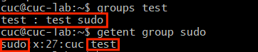
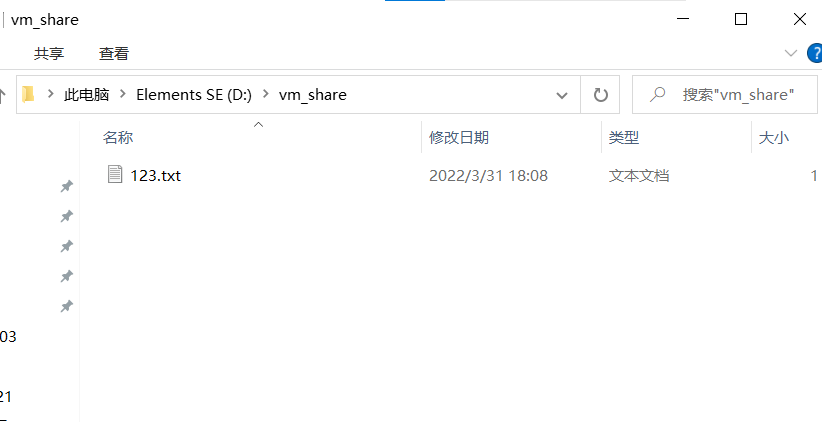
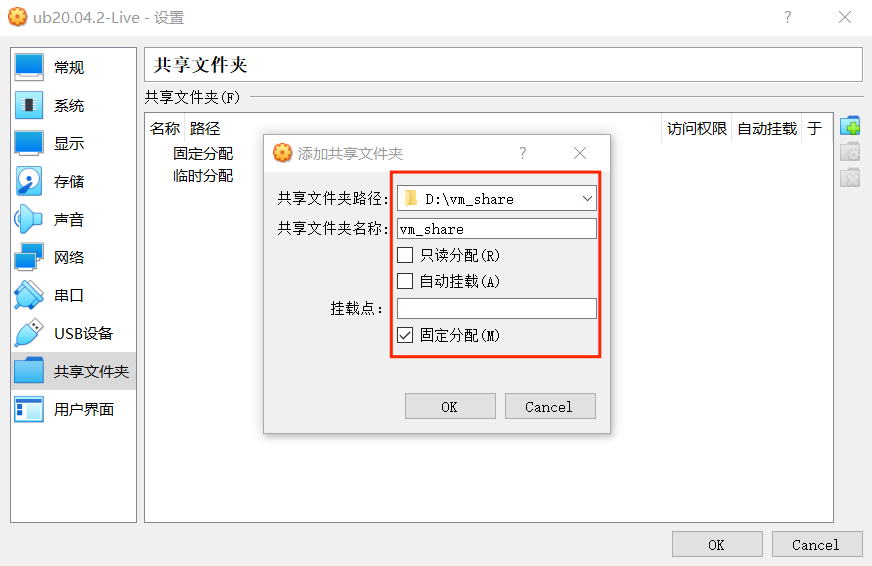
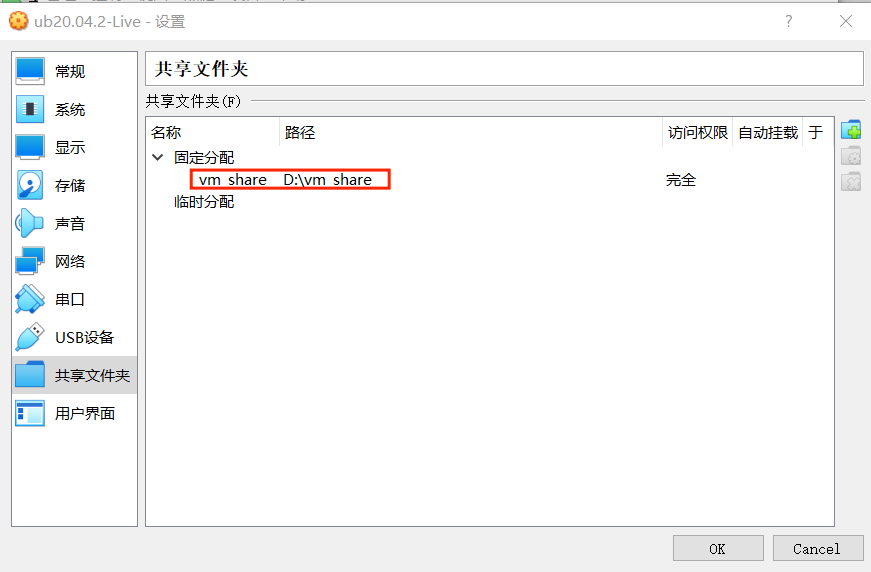
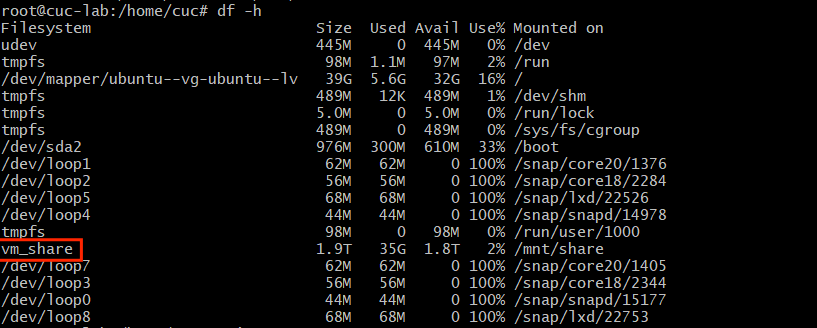
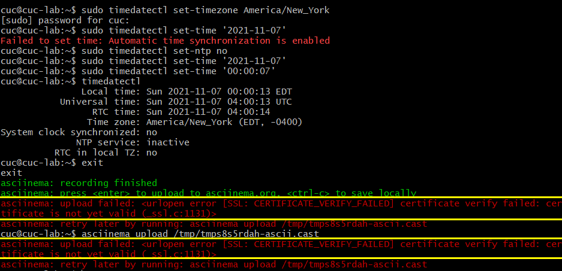
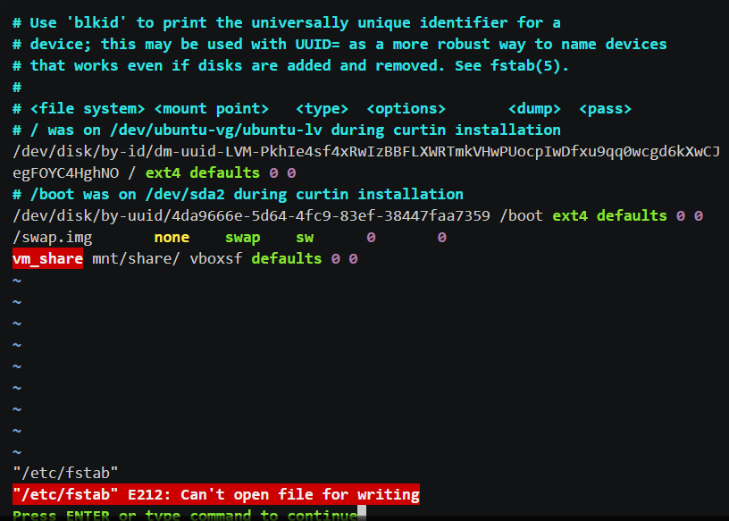
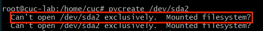

# 第三章：Linux服务器系统管理基础（实验）
----
### 实验软件环境

* Oracle VM VirtualBox
* Ubuntu20.04.2 
---
### 实验问题

* Systemd 入门教程：命令篇 by 阮一峰的网络日志
* Systemd 入门教程：实战篇 by 阮一峰的网络日志
  * 参照第2章作业的要求，完整实验操作过程通过asciinema进行录像并上传，文档通过github上传 
  
* 自查清单
  * 如何添加一个用户并使其具备sudo执行程序的权限？
  * 如何将一个用户添加到一个用户组？
  * 如何查看当前系统的分区表和文件系统详细信息？
  * 如何实现开机自动挂载Virtualbox的共享目录分区？
  * 基于LVM（逻辑分卷管理）的分区如何实现动态扩容和缩减容量？
  * 如何通过systemd设置实现在网络连通时运行一个指定脚本，在网络断开时运行另一个脚本？
  * 如何通过systemd设置实现一个脚本在任何情况下被杀死之后会立即重新启动？实现杀不死？

---
### 问题解答

1. #### Systemd 命令篇

    ##### 3.2 systemd-analyze

      * `systemd-analyze`命令用于查看启动耗时

        ```shell
        # 查看启动耗时
        systemd-analyze   
        
        #查看每个服务的启动耗时
        systemd-analyze blame

        # 显示瀑布状的启动过程流
        systemd-analyze critical-chain

        # 显示指定服务的启动流
        systemd-analyze critical-chain atd.service
        ```
        [](https://asciinema.org/a/481584)
      
    
    ##### 3.3 hostnamectl

      * `hostnamectl`命令用于查看当前主机的信息

        ```shell
        # 显示当前主机的信息
        hostnamectl

        # 设置主机名。
        sudo hostnamectl set-hostname rhel7
        ```
        [](https://asciinema.org/a/481593)


    ##### 3.4 localectl

      * `localectl`命令用于查看本地化设置。

        ```shell
        # 查看本地化设置
        localectl

        # 设置本地化参数。
        sudo localectl set-locale LANG=en_GB.utf8
        sudo localectl set-keymap en_GB
        ```
        [](https://asciinema.org/a/481595)


    ##### 3.5 timedatectl

      * `timedatectl`命令用于查看当前时区设置

        ```shell
        # 查看当前时区设置
        timedatectl

        # 显示所有可用的时区
        timedatectl list-timezones                          

        # 设置当前时区
        sudo timedatectl set-timezone America/New_York
        sudo timedatectl set-ntp no
        sudo timedatectl set-time YYYY-MM-DD
        sudo timedatectl set-time HH:MM:SS
        sudo timedatectl set-ntp true
        ```


        [](https://asciinema.org/a/481914)

    ##### 3.6 loginctl

    * `loginctl`命令用于查看当前登录的用户

        ```shell
        # 列出当前session
        loginctl list-sessions

        # 列出当前登录用户
        loginctl list-users

        # 列出显示指定用户的信息  
        loginctl show-user cuc
        ```
        [](https://asciinema.org/a/481635)

   ##### 4.1 Unit含义

    * `systemctl list-units`命令可以查看当前系统的所有 Unit

        ```shell
        # 列出正在运行的 Unit
        systemctl list-units

        # 列出所有Unit，包括没有找到配置文件的或者启动失败的
        systemctl list-units --all

        # 列出所有没有运行的 Unit
        systemctl list-units --all --state=inactive

        # 列出所有加载失败的 Unit
        systemctl list-units --failed

        # 列出所有正在运行的、类型为 service 的 Unit
        systemctl list-units --type=service
        ```
        [](https://asciinema.org/a/481917)

   ##### 4.2 Unit 的状态

    * `systemctl status`命令用于查看系统状态和单个 Unit 的状态。

        ```shell
        # 显示系统状态
        systemctl status

        # 显示单个 Unit的状态
        systemctl status bluetooth.service

        # 显示远程主机的某个 Unit 的状态
        systemctl -H root@rhel7.example.com status httpd.service
        ```

    * 除了`status`命令，`systemctl`还提供了三个查询状态的简单方法，主要供脚本内部的判断语句使用。
        ```shell
        # 显示某个 Unit 是否正在运行
        systemctl is-active application.service

        # 显示某个 Unit 是否处于启动失败状态
        systemctl is-failed application.service

        # 显示某个 Unit 服务是否建立了启动链接
        systemctl is-enabled application.service
        ```
        [](https://asciinema.org/a/481928)


   ##### 4.3 Unit 管理

    * 对于用户来说，最常用的是下面这些命令，用于启动和停止 Unit（主要是 service）

        ```shell
        # 立即启动一个服务
        sudo systemctl start apache.service

        # 立即停止一个服务
        sudo systemctl stop apache.service

        # 重启一个服务
        sudo systemctl restart apache.service

        # 杀死一个服务的所有子进程
        sudo systemctl kill apache.service

        # 重新加载一个服务的配置文件
        sudo systemctl reload apache.service

        # 重载所有修改过的配置文件
        sudo systemctl daemon-reload

        # 显示某个 Unit 的所有底层参数
        systemctl show httpd.service

        # 显示某个 Unit 的指定属性的值
        systemctl show -p CPUShares httpd.service

        # 设置某个 Unit 的指定属性
        sudo systemctl set-property httpd.service CPUShares=500
        ```
        [](https://asciinema.org/a/482008)

   ##### 4.4 依赖关系

    * Unit 之间存在依赖关系：A 依赖于 B，就意味着 Systemd 在启动 A 的时候，同时会去启动 B
    `systemctl list-dependencies`命令列出一个 Unit 的所有依赖

        ```shell
        systemctl list-dependencies nginx.service
        ```
    
    * 上面命令的输出结果之中，有些依赖是 Target 类型（详见下文），默认不会展开显示。如果要展开 Target，就需要使用`--all`参数。
        ```shell
        systemctl list-dependencies --all nginx.service
        ```
        [](https://asciinema.org/a/482013)
      

    ##### 5.1 概述     
    * 每一个 Unit 都有一个配置文件，告诉 Systemd 怎么启动这个 Unit 。
      Systemd 默认从目录`/etc/systemd/system/`读取配置文件。但是，里面存放的大部分文件都是符号链接，指向目录`/usr/lib/systemd/system/`，真正的配置文件存放在那个目录。

      `systemctl enable`命令用于在上面两个目录之间，建立符号链接关系。
        ```shell
        sudo systemctl enable clamd@scan.service
        # 等同于
        sudo ln -s '/usr/lib/systemd/system/clamd@scan.service' '/etc/systemd/system/multi-user.target.wants/clamd@scan.service'
        ```

    * 如果配置文件里面设置了开机启动，`systemctl enable`命令相当于激活开机启动。

      与之对应的，`systemctl disable`命令用于在两个目录之间，撤销符号链接关系，相当于撤销开机启动。
        ```shell
        sudo systemctl disable clamd@scan.service
        ```

    * 配置文件的后缀名，就是该 Unit 的种类，比如`sshd.socket`。如果省略，Systemd 默认后缀名为`.service`，所以`sshd`会被理解成`sshd.service`。
        [](https://asciinema.org/a/482019)

  
   ##### 5.2 配置文件的状态

    * `systemctl list-unit-files`命令用于列出所有配置文件  
  
        ```shell
        # 列出所有配置文件
        systemctl list-unit-files

        # 列出指定类型的配置文件
        systemctl list-unit-files --type=service
        ```
    * 这个命令会输出一个列表。

        ```shell
        systemctl list-unit-files

        UNIT FILE              STATE
        chronyd.service        enabled
        clamd@.service         static
        clamd@scan.service     disabled
        ```
    * 注意，从配置文件的状态无法看出，该 Unit 是否正在运行。这必须执行前面提到的`systemctl status`命令。
  
        ```shell
        systemctl status bluetooth.service
        ```
    
    * 一旦修改配置文件，就要让 SystemD 重新加载配置文件，然后重新启动，否则修改不会生效
        ```shell
        sudo systemctl daemon-reload
        sudo systemctl restart httpd.service
        ```
        [](https://asciinema.org/a/482028)

    ##### 5.3 配置文件的格式

    * 配置文件就是普通的文本文件，可以用文本编辑器打开。

      `systemctl cat`命令可以查看配置文件的内容。
        ```shell
        systemctl cat atd.service

        [Unit]
        Description=ATD daemon

        [Service]
        Type=forking
        ExecStart=/usr/bin/atd

        [Install]
        WantedBy=multi-user.target
        ```
        [](https://asciinema.org/a/482034)

    ##### 6 target
    * 启动计算机的时候，需要启动大量的 Unit。如果每一次启动，都要一一写明本 次启动需要哪些 Unit，显然非常不方便。Systemd 的解决方案就是 Target。

      简单说，Target 就是一个 Unit 组，包含许多相关的 Unit 。启动某个 Target 的时候，Systemd 就会启动里面所有的 Unit。从这个意义上说，Target 这个概念类似于"状态点"，启动某个 Target 就好比启动到某种状态。

      传统的init启动模式里面，有 RunLevel 的概念，跟 Target 的作用很类似。不同的是，RunLevel 是互斥的，不可能多个 RunLevel 同时启动，但是多个 Target 可以同时启动。

        ```shell
        # 查看当前系统的所有 Target
        systemctl list-unit-files --type=target

        # 查看一个 Target 包含的所有 Unit
        systemctl list-dependencies multi-user.target

        # 查看启动时的默认 Target
        systemctl get-default

        # 设置启动时的默认 Target
        sudo systemctl set-default multi-user.target

        # 切换 Target 时，默认不关闭前一个 Target 启动的进程，
        # systemctl isolate 命令改变这种行为，
        # 关闭前一个 Target 里面所有不属于后一个 Target 的进程
        sudo systemctl isolate multi-user.target
        ```
        [](https://asciinema.org/a/482043)

    ##### 7 日志管理
    
    * Systemd 统一管理所有 Unit 的启动日志。带来的好处就是，可以只用`journalctl`一个命令，查看所有日志（内核日志和应用日志）。日志的配置文件是`/etc/systemd/journald.conf`。
    `journalctl`功能强大，用法非常多

        ```shell
        # 查看所有日志（默认情况下 ，只保存本次启动的日志）
        sudo journalctl

        # 查看内核日志（不显示应用日志）
        sudo journalctl -k

        # 查看系统本次启动的日志
        sudo journalctl -b
        sudo journalctl -b -0

        # 查看上一次启动的日志（需更改设置）
        sudo journalctl -b -1

        # 查看指定时间的日志
        sudo journalctl --since="2012-10-30 18:17:16"
        sudo journalctl --since "20 min ago"
        sudo journalctl --since yesterday 
        sudo journalctl --since "2015-01-10" --until "2015-01-11 03:00"
        sudo journalctl --since 09:00 --until "1 hour ago"

        # 显示尾部的最新10行日志
        sudo journalctl -n

        # 显示尾部指定行数的日志
        sudo journalctl -n 20

        # 实时滚动显示最新日志
        sudo journalctl -f

        # 查看指定服务的日志
        sudo journalctl /usr/lib/systemd/systemd

        # 查看指定进程的日志
        sudo journalctl _PID=1

        # 查看某个路径的脚本的日志
        sudo journalctl /usr/bin/bash

        # 查看指定用户的日志
        sudo journalctl _UID=33 --since today

        # 查看某个 Unit 的日志
        sudo journalctl -u nginx.service
        sudo journalctl -u nginx.service --since today

        # 实时滚动显示某个 Unit 的最新日志
        sudo journalctl -u nginx.service -f

        # 合并显示多个 Unit 的日志
        journalctl -u nginx.service -u php-fpm.service --since today

        # 查看指定优先级（及其以上级别）的日志，共有8级
        # 0: emerg
        # 1: alert
        # 2: crit
        # 3: err
        # 4: warning
        # 5: notice
        # 6: info
        # 7: debug
        sudo journalctl -p err -b

        # 日志默认分页输出，--no-pager 改为正常的标准输出
        sudo journalctl --no-pager

        # 以 JSON 格式（单行）输出
        sudo journalctl -b -u nginx.service -o json

        # 以 JSON 格式（多行）输出，可读性更好
        sudo journalctl -b -u nginx.service -o json-pretty

        # 显示日志占据的硬盘空间
        sudo journalctl --disk-usage

        # 指定日志文件占据的最大空间
        sudo journalctl --vacuum-size=1G

        # 指定日志文件保存多久
        sudo journalctl --vacuum-time=1years
        ```

      [](https://asciinema.org/a/482055)


2. #### Systemed 实战篇
  
    ##### 一、开机启动
    * 对于那些支持 Systemd 的软件，安装的时候，会自动在`/usr/lib/systemd/system`目录添加一个配置文件。
      如果你想让该软件开机启动，就执行下面的命令（以`atd.service`为例）。
        ```shell
        sudo systemctl enable httpd
        ```
      上面的命令相当于在`/etc/systemd/system`目录添加一个符号链接，指向/usr/`lib/systemd/system`里面的`atd.service`文件。
      这是因为开机时，`Systemd`只执行`/etc/systemd/system`目录里面的配置文件。这也意味着，如果把修改后的配置文件放在该目录，就可以达到覆盖原始配置的效果

      [](https://asciinema.org/a/482126)

    ##### 二、启动服务
     * 设置开机启动以后，软件并不会立即启动，必须等到下一次开机。如果想现在就运行该软件，那么要执行`systemctl start`命令。
        
        ```shell
        sudo systemctl start httpd
        ```
    * 执行上面的命令以后，有可能启动失败，因此要用`systemctl status`命令查看一下该服务的状态。
        ```shell
        sudo systemctl status httpd
        ```
        [](https://asciinema.org/a/482154)

    ##### 三、停止服务
    * 终止正在运行的服务，需要执行`systemctl stop`命令。
        ```shell
        sudo systemctl stop httpd.service
        ```

    * 有时候，该命令可能没有响应，服务停不下来。这时候就不得不"杀进程"了，向正在运行的进程发出`kill`信号。
        ```shell
        sudo systemctl kill httpd.service
        ```

    * 此外，重启服务要执行`systemctl restart`命令。
        ```shell
        sudo systemctl restart httpd.service
        ```

    ##### 四、读懂配置文件
    * 一个服务怎么启动，完全由它的配置文件决定。下面就来看，配置文件有些什么内 容。

      前面说过，配置文件主要放在`/usr/lib/systemd/system`目录，也可能在`/etc/systemd/system`目录。找到配置文件以后，使用文本编辑器打开即可。

      `systemctl cat`命令可以用来查看配置文件，下面以`sshd.service`文件为例，它的作用是启动一个 SSH 服务器，供其他用户以 SSH 方式登录。

        ```shell
        systemctl cat sshd.service
        ```

    ##### 五、 [Unit] 区块：启动顺序与依赖关系
      * `Unit`区块的`Description`字段给出当前服务的简单描述，`Documentation`字段给出文档位置。

        接下来的设置是启动顺序和依赖关系，这个比较重要。
        相应地，还有一个`Before`字段，定义`sshd.service`应该在哪些服务之前启动。

        注意，`After`和`Before`字段只涉及启动顺序，不涉及依赖关系。

        举例来说，某 Web 应用需要 `postgresql `数据库储存数据。在配置文件中，它只定义要在 `postgresql `之后启动，而没有定义依赖` postgresql` 。上线后，由于某种原因，`postgresql `需要重新启动，在停止服务期间，该 Web 应用就会无法建立数据库连接。

        设置依赖关系，需要使用`Wants`字段和`Requires`字段。

        `Requires`字段则表示"强依赖"关系，即如果该服务启动失败或异常退出，那么`sshd.service`也必须退出。

        注意，`Want`s字段与`Requires`字段只涉及依赖关系，与启动顺序无关，默认情况下是同时启动的。

    ##### 六、[Service] 区块：启动行为
    `Service`区块定义如何启动当前服务。
    * 6.1 启动命令
    许多软件都有自己的环境参数文件，该文件可以用`EnvironmentFile`字段读取
    `EnvironmentFile`字段：指定当前服务的环境参数文件。该文件内部的`key=value`键值对，可以用`$key`的形式，在当前配置文件中获取。

      上面的例子中，`sshd` 的环境参数文件是`/etc/sysconfig/sshd`。

      配置文件里面最重要的字段是`ExecStart`。

      `ExecStart`字段：定义启动进程时执行的命令。

      上面的例子中，启动`sshd`，执行的命令是`/usr/sbin/sshd -D $OPTIONS`，其中的变量`$OPTIONS`就来自`EnvironmentFile`字段指定的环境参数文件。

    * 6.2 启动类型
    配置文件中，`RemainAfterExit`字段设为`yes`，表示进程退出以后，服务仍然保持执行。这样的话，一旦使用`systemctl stop`命令停止服务，`ExecStop`指定的命令就会执行，从而重新开启触摸板。

    * 6.3 重启行为
        * `Service`区块有一些字段，定义了重启行为.
          `KillMode`字段：定义 `Systemd` 如何停止 `sshd `服务。

          上面这个例子中，将`KillMode`设为`process`，表示只停止主进程，不停止任何`sshd `子进程，即子进程打开的 `SSH session` 仍然保持连接。这个设置不太常见，但对 `sshd` 很重要，否则你停止服务的时候，会连自己打开的 `SSH session` 一起杀掉。

        * 接下来是`Restart`字段。

          `Restart`字段：定义了` sshd` 退出后，`Systemd` 的重启方式。

          上面的例子中，`Restart`设为`on-failure`，表示任何意外的失败，就将重启`sshd`。如果` sshd` 正常停止（比如执行`systemctl stop`命令），它就不会重启。

          
    ##### 七、[Install] 区块
    * Systemd 有默认的启动 Target。
        ```shell
        systemctl get-default 
        multi-user.target
        ```
    * 上面的结果表示，默认的启动 Target 是`multi-user.target`。在这个组里的所有服务，都将开机启动。这就是为什么`systemctl enable`命令能设置开机启动的原因。

      使用 Target 的时候，`systemctl list-dependencies`命令和`systemctl isolate`命令也很有用。

        ```shell
        # 查看 multi-user.target 包含的所有服务
        systemctl list-dependencies multi-user.target

        # 切换到另一个 target
        # shutdown.target 就是关机状态  
        sudo systemctl isolate shutdown.target
        ```
    
    * 一般来说，常用的 Target 有两个：一个是`multi-user.target`，表示多用户命令行状态；另一个是`graphical.target`，表示图形用户状态，它依赖于`multi-user.target`。官方文档有一张非常清晰的 Target 依赖关系图。

    ##### 八、Target 的配置文件
    * Target 也有自己的配置文件,注意，Target 配置文件里面没有启动命令。
        ```shell
        systemctl cat multi-user.target
        ```
    ##### 九、修改配置文件后重启
    * 修改配置文件以后，需要重新加载配置文件，然后重新启动相关服务。

        ```shell
        # 重新加载配置文件
        sudo systemctl daemon-reload

        # 重启相关服务
        sudo systemctl restart foobar
        ```
 * 全过程视频链接：[](https://asciinema.org/a/484099)


3. #### 自查清单
   
   ##### 1.添加一个用户并使其具备sudo执行程序的权限
   * 创建一个新用户，并且添加到sudo组中。
        ```shell
        #创建名为test的新用户
        sudo adduser test

        #将test用户添加到sudo组
        sudo usermod -G sudo test
        ```
        [](https://asciinema.org/a/482205)
        
   * 利用`groups test`或`getent group sudo`验证正确。
        

   ##### 2.将一个用户添加到一个用户组 
   * 相似，创建一个用户test1，并将它加入到root组。
        ```shell
        #查询现有用户组和其下用户
        cat/etc/group

        #创建名为test1的用户
        sudo adduser test1

        #将test用户添加到sudo组
        sudo usermod -G sudo test

        #验证是否成功
        groups test1
        ```

        [](https://asciinema.org/a/482752)

   ##### 3.查看当前系统的分区表和文件系统详细信息
    * 查看当前系统分区表主要用`fdisk`工具，它与`df`的区别是，前者是分区工具，后者用来查看文件系统分区情况。当两者同时用来查看分区信息时，较为相似，前者侧重于显示分区表的信息，后者侧重于显示当前系统中所有文件系统的信息。
        ```shell
        #需要`su`
        #查看当前分区表信息
        fdisk -l
        ```

    * 查看文件系统主要用到两个命令，`mount`和`dumpe2fs`
        ```shell
        #查看现有的文件系统类型
        mount

        #叫出目前挂载的装置
        df
        #查看文件系统信息
        dumpe2fs [-h] 文件名
        ```
        [](https://asciinema.org/a/482807)

    ##### 4.实现开机自动挂载Virtualbox的共享目录分区
    * 在d盘创建一个文件夹用来共享。这里我在文件夹里还创建了一个有内容的文本文档。
     

    * 配置共享文件夹，要选择固定分配。
      
    
    * 配置完成后如下图所示：
      
    
    * 实现挂载：
        ```shell
        #新建Ubuntu文件夹
        sudo mkdir /mnt/share

        #挂载命令
        sudo mount -t vboxsf vm_share /mnt/share/ 

        #查看共享目录
        cd /mnt/share
        ```
    
    * 实现开机自动挂载：
        ```shell
        #切换到root用户
        su

        #需重新挂载/跟系统，解决Linux下 /etc/fstab 修改保存提示只读的解决办法
        mount -o remount,rw /

        #编辑文件
        vim /etc/fstab

        #添加
        vm_share /mnt/share/ vboxsf defaults 0 0
        ```
   * 通过`df -h`检查是否自动挂载，成功。
      
    
   * 视频链接：
      [](https://asciinema.org/a/482848)

    ##### 5. 基于LVM（逻辑分卷管理）的分区如何实现动态扩容和缩减容量
    * 先查看磁盘信息、存在的pv和pv的详细信息。
          ```shell
          #磁盘信息
          fdisk -l

          #存在的pv
          pvscan

          #pv的详细信息
          pvdisplay
          ```
    * 创建物理卷。
          ```shell
          #取消分区挂载
          umount /dev/sda2

          #创建
          pvcreate /dev/sda2
          ```
    * 利用`pvscan`再次查看pv,发现已经添加了新的物理卷，然后检查卷组,发现只有ubuntu-vg一个。
      ```shell
      vgdisplay
      ```
    
    * 创建逻辑卷，利用`lvcreate`命令，`-l`参数为定PE数来设定逻辑分区大小，`-n`参数指定逻辑分区名称。
      ```shell
      lvcreate -l 2000 -n lv_test ubuntu-vg
      ```
    
    * 用`lvdisplay`检查，已经生成新的卷组，大小为7.81GiB。用`lsblk`命令检查，也可以看到新生成的逻辑卷分区。
  
    * 使用`mkfs.ext4`命令将/dev/ubuntu-vg/lv_test格式化ext4格式的文件系统。
      ```shell
      mkfs.ext4 /dev/ubuntu-vg/lv_test
      ```
    
    * 用`mkdir`创建文件夹test,自然将/dev/ubuntu-vg/lv_test挂载到/test这个文件夹上面，并使用`df`命令进行查看。通过途中可以看见/dev/ubuntu-vg/lv_test被以ext4的格式挂载到了/test下面。
      ```shell
      #创建文件夹
      mkdir /test

      #挂载
      mount /dev/ubuntu-vg/lv_test /test

      #查看是否成功挂载
      df -hT
      ```

    * 逻辑卷扩展
      我们只分配了7.8G的容量给lv_test这个逻辑卷。如果是传统分区方式，我们只能是暂停服务后把数据转移到一个容量更大的硬盘分区当中，再重启服务。

      lvm逻辑卷的方式可以让我们在不暂停服务的情况下动态扩展分区的大小。通过`vgdisplay`命令打印的信息，我们可以看到卷重unbuntu-vg已经分配的容量和闲置容量。

      使用`lvextend`命令为lv_test增加了10GB空间，从图中可以看出lv_test的容量改变为18.00GiB。我们对lvm分区lv_test的空间的扩展那操作已经完成。我们还需要对文件系统进行扩展，我们的文件系统为etx4格式，所以我们使用resize2fs命令对lv_test的文件系统进行动态扩展。
        ```shell
        #分区空间扩展
        lvextend -L +10G /dev/ubuntu-vg/lv_test 

        #文件动态扩展
        resize2fs /dev/ubuntu-vg/lv_test

        #查看容量
        df -hT

     * 逻辑卷缩减
       * 利用lvm逻辑卷的机制，我们可以对容量进行扩展，相对的我们也可以对容量进行 缩减。我们先利用`umount`命令将/test进行卸载，并查看逻辑卷lv_test的最新信息。
        使用e2fsck命令检查文件系统完整性，再使用resize2fs命令把逻辑卷lv_test的文件系统压缩至10GB。
        对文件系统进行压缩一定要慎重，这个操作可能会造成文件的丢失。举例：已经存在30GB的数据，你要将文件系统压缩至10GB，那么必然会造成数据的丢失。
          ```shell
          #卸载
          umount /test

          #查看逻辑卷情况 
          lvdisplay

          #检查完整性
          e2fsck -f /dev/ubuntu-vg/lv_test

          #文件压缩
          resize2fs /dev/ubuntu-vg/lv_test 10G
          ```
        
        * 文件系统压缩完成后，我们使用lvreduce命令对lv_test分区进行压缩，执行过程中会给你一个警告，问你是否确定缩减分区大小。
        缩减完成后，使用mount命令把lv_test挂载会/test目录。然后使用df命令再次查看挂载状态。如图所示，我们已经将名为lv_mysql的lvm逻辑卷缩减至10GB的容量。
          ```shell
          #压缩分区
          lvreduce -L 10G /dev/ubuntu-vg/lv_test

          #重新挂载
          mount /dev/ubuntu-vg/lv_test /test

          #查看压缩后大小
          df -hT
    * 视频链接：[](https://asciinema.org/a/483825)

    ##### 6.通过systemd设置实现在网络连通时运行一个指定脚本，在网络断开时运行另一个脚本
    * 进入 systemd 放置 service 的目录，在该目录下可看到大量服务配置文件。相关命令如下:
       ```shell
       cd /etc/systemd/system
       systemctl cat systemd-networkd.service
       sudo systemctl stop systemd-networkd.service
       systemctl daemon-reload
       sudo systemctl stop systemd-networkd.service
       sudo systemctl start systemd-networkd.service
       journalctl -xe
       ```
    * 视频链接： [](https://asciinema.org/a/484053)


    ##### 7.通过systemd设置实现一个脚本在任何情况下被杀死之后会立即重新启动
   
   * 先进入/etc/systemd/system，显示所有.service文件，然后修改文件内容，再重新加载配置文件和相关服务即可。

        ```shell
        cd /etc/systemd/system
        ls
        sudo vim sshd.service

        # 文件设置
        Restart=always 

        #设置完毕后
        sudo systemctl daemon-reload
        sudo systemctl restart sshd.service 
        ```

   * （以sshd.service为例）视频链接：[](https://asciinema.org/a/484097)


-----
### 错误和解决方案

1. #### Systemd 命令篇
  
    ##### 3.5 timedatectl
    * 上传时出现的错误如下：
    
    经查阅资料（见参考资料3、4），发现是时钟同步设置出现问题，采用方法：
    ```shell
    #手动修改服务器时间,需执行
    sudo timedatectl set-ntp no 

    #因为虚拟机的时间与本地不相同，所以上传失败。应将时钟与互联网同步
    sudo timedatectl set-ntp true
    ```


2. #### 自查清单
    ##### 4.实现开机自动挂载Virtualbox的共享目录分区
    * 在编辑`/etc/fstab`的过程中，出现提示"/etc/fstab" E212: Can't open file for writing
    
    一开始用`wq!`强制保存，后无果，查询之后发现是因为系统启动时加载文件系统失败，导致进入单用户模式。于是采用方法：
      ```shell
      #需要进入root用户，否则会提示mount: only root can use "--options" option
      su

      #重新挂载系统
      mount -o remount,rw /
      ```

    * 然后就可以编辑文件了。详细操作过程见上述实验过程。

    ##### 5.基于LVM（逻辑分卷管理）的分区如何实现动态扩容和缩减容量
    * 在创建pv过程中，出现报错“ Can't open /dev/sda2 exclusively.  Mounted filesystem?”
    
    查询后是因为分区文件正在使用，需要用`umount`命令解决。

    

-----
### 参考资料

1.[Systemd 入门教程：命令篇](http://www.ruanyifeng.com/blog/2016/03/systemd-tutorial-commands.html)

2.[Systemd 入门教程：实战篇](http://www.ruanyifeng.com/blog/2016/03/systemd-tutorial-part-two.html)

3.[如何在 Ubuntu 上设置时间同步](https://linux.cn/article-11220-1.html)

4.[centos7修改服务器时间报错--Failed to set time: Automatic time synchronization is enabled](https://blog.csdn.net/xzm5708796/article/details/103733211)

5.[Linux命令学习—— fdisk -l 查看硬盘及分区信息](https://www.cnblogs.com/yizhipanghu/p/10118983.html#:~:text=%E5%B8%B8%E7%94%A8%E7%94%A8%E6%B3%95%EF%BC%9A%20fdisk,-l%20%E6%9F%A5%E7%9C%8B%E5%BD%93%E5%89%8D%E7%9A%84%E7%A3%81%E7%9B%98%E5%88%86%E5%8C%BA%E4%BF%A1%E6%81%AF%20%28%E4%B8%BB%E8%A6%81%E6%98%AF%E5%88%86%E5%8C%BA%E8%A1%A8%E4%BF%A1%E6%81%AF%29)

6.[Linux dumpe2fs命令：查看文件系统信息](http://c.biancheng.net/view/889.html)

7.[如何在Linux维护模式中编辑fstab文件](https://www.cnblogs.com/felix-h/p/11043211.html)

8.[Virtualbox实现共享文件夹并自动挂载](https://blog.csdn.net/hexf9632/article/details/93774198)

9.[Linux中利用LVM实现分区动态扩容](https://blog.csdn.net/seteor/article/details/6708025)

10.[Lvm逻辑卷管理、创建、使用、扩展、缩减、迁移、快照、恢复](https://blog.csdn.net/xusong1998/article/details/110944930)

11.[在 Ubuntu 上使用 systemd 配置开机执行脚本](https://zhuanlan.zhihu.com/p/340755873)