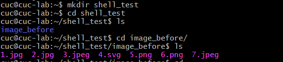
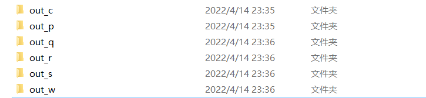
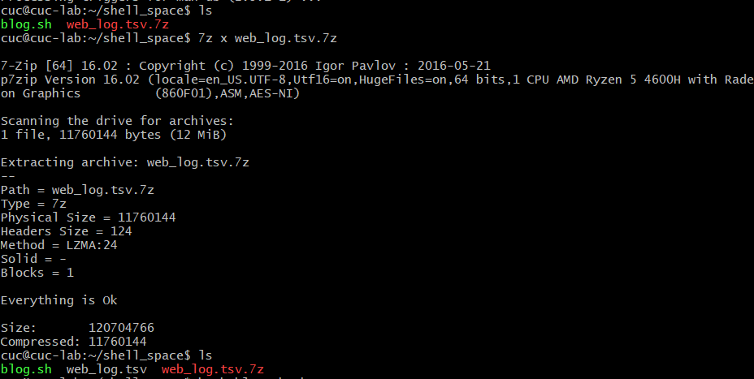
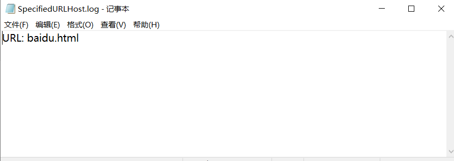

# 第三章：shell脚本编程实验
---
### 实验软件环境

- Ubuntu 20.04
- bash
- imagemagick
- 7zip-full
- Travis
---
### 实验问题：

任务一：用bash编写一个图片批处理脚本，实现以下功能
- [x] 支持命令行参数方式使用不同功能
- [x] 支持对指定目录下所有支持格式的图片文件进行批处理
- [x] 支持以下常见图片批处理功能的单独使用或组合使用
- [x] 支持对jpeg格式图片进行图片质量压缩
- [x] 支持对jpeg/png/svg格式图片在保持原始宽高比的前提下压缩分辨率
- [x] 支持对图片批量添加自定义文本水印
- [x] 支持批量重命名（统一添加文件名前缀或后缀，不影响原始文件扩展名）
- [x] 支持将png/svg图片统一转换为jpg格式图片

任务二：

1.用bash编写一个文本批处理脚本，对以下附件分别进行批量处理完成相应的数据统计任务

- [x] 统计不同年龄区间范围（20岁以下、[20-30]、30岁以上）的球员数量、百分比
- [x] 统计不同场上位置的球员数量、百分比
- [x] 名字最长的球员是谁？名字最短的球员是谁？
- [x] 年龄最大的球员是谁？年龄最小的球员是谁？

2.Web服务器访问日志
- [x] 统计访问来源主机TOP 100和分别对应出现的总次数
- [x] 统计访问来源主机TOP 100 IP和分别对应出现的总次数
- [x] 统计最频繁被访问的URL TOP 100
- [x] 统计不同响应状态码的出现次数和对应百分比
- [x] 分别统计不同4XX状态码对应的TOP 10 URL和对应出现的总次数
- [x] 给定URL输出TOP 100访问来源主机
---
### 问题解答
##### 1.用bash编写一个图片批处理脚本
- 代码如下：
  [change_img.sh](code/change_img.sh)
- 过程：
  - 下载imagemagick和shellcheck
      ```shell
      sudo apt install imagemagick
      sudo apt install shellcheck
      ```
  - 创建shell_test文件夹,用来存放代码和实验图片
    ```shell
    mkdir shell_test
    ```
  - 将需要进行处理的图片传入虚拟机：

      ```shell
      #要在本地git-bash中输入
      scp -r image_before/ cuc@192.168.56.101:/home/cuc/shell_test
      ```

    

  - 用vscode-remote连接虚拟机，编写change_img.sh文件

  - 测试：
  
    ``` shell
    # help帮助文档
    bash change_img.sh -h

    # 对jpeg格式图片进行图片质量压缩
    bash change_img.sh -d image_before/ -q 50% 

    # 对jpeg/png/svg格式图片在保持原始宽高比的前提下压缩分辨率
    bash change_img.sh -d image_before/ -r 80

    # 对图片批量添加自定义文本水印
    bash change_img.sh -d image_before/ -w "star"

    # 批量重命名（统一添加文件名前缀或后缀，不影响原始文件扩展名）
    bash change_img.sh -d image_before/ -p "pre"
    bash change_img.sh -d image_before/ -s "suf"

    # 将png/svg图片统一转换为jpg格式图片
    bash change_img.sh -d img_before/ -c 100
    ```

  - 结果；
    


  - help帮助文档：
    ```shell
    image.sh - For Images Batch Processing.

    Tips: Before using this script, be sure you have installed ImageMagick, or input 'sudo apt install imagemagick' to install.
   
    Usage: bash image.sh [arguments]
   
    Arguments:                                                                                             
    -d <path>             : Iuput the path of the picture that you want to operate.                      
    -q <percentage>       : Compress the quality of JPG images,                                          
                          eg: -q 50% (means compress 50%).                                             
    -r <width>            : Compress the resolution of JPEG/PNG/SVG images,                              
                          eg: -r 50 (means compress width to 50).                                      
    -w <text>             : Embed text watermark in all images.                                          
    -p <pre_text>         : Rename all files by adding prefix.                                           
    -s <suf_text>         : Rename all files by adding suffix.                                           
    -c                    : Convert PNG/SVG images to JPEG images.                                       
    -h or --help          : Print Help (this message) and exit.                                    
    ```
- 视频链接：
  [](https://asciinema.org/a/487563)


##### 2-1. bash编写一个文本批处理脚本，对以下附件分别进行批量处理完成相应的数据统计任务

- 数据和代码如下:
  - [2014世界杯运动员数据](worldcupplayerinfo.tsv)
  - [player.sh](code/player.sh)

- 过程：
  - 用`mkdir shell_ing`创建文件夹，用来存放代码和数据，
  - 下载数据
      ```shell
      wget "https://c4pr1c3.gitee.io/linuxsysadmin/exp/chap0x04/worldcupplayerinfo.tsv"
      ```
  - 用vscode-remote连接虚拟机，编写player.sh文件

  - 测试：

    ``` shell
    # help帮助文档
    bash player.sh -h

    #统计不同年龄区间范围（20岁以下、[20-30]、30岁以上）的球员数量、百分比
    bash player.sh -s

    #统计不同场上位置的球员数量、百分比
    bash player.sh -p

    #统计名字最长和最短的球员
    bash player.sh -n

    #统计年龄最大和最小的球员
    bash player.sh -a
    ```
  - 结果：
    [2-1结果](task2_results.md)

  - help帮助文档：
    ```shell
    player.sh - For World Cup Player Infomation Statistics Analysing.
    
    Tips: Before using this script, making sure the worldcupplayerinfo.tsv file is in the working directory

    Usage: bash player.sh [arguments] 
    Arguments:
    -s                 统计不同年龄区间范围（20岁以下、[20-30]、30岁以上）的球员数量、百分比                                            
    -p                 统计不同场上位置的球员数量、百分比                                                                   
    -n                 名字最长的球员是谁？名字最短的球员是谁？                                                                
    -a                 年龄最大的球员是谁？年龄最小的球员是谁
    -h                 帮助文档
    ```
- 视频链接：
   [](https://asciinema.org/a/SWYKUZuJreQDTS1WExNzb476v)

##### 2-2. Web服务器访问日志

- 数据和代码如下:
  - [web_log.tsv.7z](web_log.tsv.7z)
  * [blog.sh](code/blog.sh)


- 过程
  - 下载文件，安装7zip解压文件
    ```shell
    sudo apt-get install 7zip-full
    7z x web_log.tsv.7z
    ```
    
  
  - 用vscode-remote连接虚拟机，编写blog.sh文件
  - 测试：
    ```shell
    # help帮助文档
    bash blog.sh -h

    # 统计访问来源主机TOP 100和分别对应出现的总次数
    bash blog.sh -o 100

    # 统计访问来源主机TOP 100 IP和分别对应出现的总次数
    bash blog.sh -i 100

    # 统计最频繁被访问的URL TOP 100
    bash blog.sh -u 100

    # 统计不同响应状态码的出现次数和对应百分比
    bash blog.sh -c

    # 分别统计不同4XX状态码对应的TOP 10 URL和对应出现的总次数
    bash blog.sh -f 100

    # 给定URL输出TOP 100访问来源主机
    bash blog.sh -s  /elv/SCOUT/scout.gif
    ```
  - 结果：
    [2-2结果](task2-2_results.md)

  - help帮助文档：
    ```shell
    blog.sh - For Web Client Access Log Analysing.

    Tips: Before using this script, making sure the web_log.tsv file is in the working directory

    Usage: bash blog.sh [arguments]
    Arguments:
    -o      统计访问来源主机TOP 100和分别对应出现的总次数
    -i      统计访问来源主机TOP 100 IP和分别对应出现的总次数
    -u      统计最频繁被访问的URL TOP 100
    -c      统计不同响应状态码的出现次数和对应百分比
    -f      分别统计不同4XX状态码对应的TOP 10 URL和对应出现的总次数
    -s URL  给定URL输出TOP 100访问来源主机
    -h      帮助文档
    ```
- 视频链接：
  [](https://asciinema.org/a/pOjmLtVbvFET4uLCpJTWjPAx0)

----
### 问题与解决方案：
- 问题： 在给定URL输出TOP 100访问来源主机时，用输入`baidu.com`并没有得到任何结果。
   

- 解决方法：应该从给定数据中挑选url,比如在统计不同4XX状态码对应的TOP 10 URL和对应出现的总次数时出现的`/elv/SCOUT/scout.gif`即可得到结果。
------

### 参考资料：

- [2021-linux-public-Annna777](https://github.com/CUCCS/2021-linux-public-Annna777)
- [2021-linux-public-real-pcl](https://github.com/CUCCS/2021-linux-public-real-pcl)
- [scp图片压缩问题](https://stackoverflow.com/questions/43522939/resizing-svg-image-using-convert-function-of-imagemagick-suite-produces-empty)
- [将文件导入虚拟机以及将虚拟机中的文件导出到本地电脑scp命令](https://www.cnblogs.com/Teachertao/p/9571285.html)
- [if [ $# -eq 0 ]等语句定义](https://blog.csdn.net/qq_36932624/article/details/84594085)
- [Shell中的$0、$1、$2的含义](https://blog.csdn.net/weixin_43161811/article/details/84067192)
- [convert-linux-command-unix-command](https://www.lifewire.com/convert-linux-command-unix-command-4097060)
- [cenvert与mogrify的简单使用](https://www.jianshu.com/p/85a86b45c9ed)
- [Linux awk 命令](https://www.runoob.com/linux/linux-comm-awk.html)