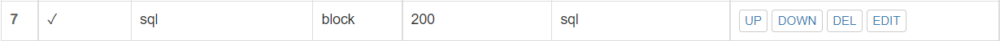

# 第五章：Web服务器（实验）
---
### 实验环境

- 测试客户端：
  - Windows 10
- 服务端
  - Ubuntu20.04
    - VeryNginx
    - Nginx
    - Wordpress
    - DVWA
  
  | 服务 | 端口 |
  | ----| ----- |
  |verynginx|80|
  |nginx|8080|
  |wordpress|8081|
  |dvwa|8082|
  
---
### 实验问题

1.基本要求：

- [x] 在一台主机（虚拟机）上同时配置Nginx和VeryNginx
  - [x] VeryNginx作为本次实验的Web App的反向代理服务器和WAF
  - [x] PHP-FPM进程的反向代理配置在nginx服务器上，VeryNginx服务器不直接配置Web站点服务
- [x] 使用Wordpress搭建的站点对外提供访问的地址为： http://wp.sec.cuc.edu.cn
- [x] 使用Damn Vulnerable Web Application (DVWA)搭建的站点对外提供访问的地址为： http://dvwa.sec.cuc.edu.cn


2.安全加固要求：


- [x] 使用IP地址方式均无法访问上述任意站点，并向访客展示自定义的友好错误提示信息页面-1
- [x] Damn Vulnerable Web Application (DVWA)只允许白名单上的访客来源IP，其他来源的IP访问均向访客展示自定义的友好错误提示信息页面-2
- [x] 在不升级Wordpress版本的情况下，通过定制VeryNginx的访问控制策略规则，热修复WordPress < 4.7.1 - Username Enumeration
- [x] 通过配置VeryNginx的Filter规则实现对Damn Vulnerable Web Application (DVWA)的SQL注入实验在低安全等级条件下进行防护

3.VeryNginx配置要求


- [x] VeryNginx的Web管理页面仅允许白名单上的访客来源IP，其他来源的IP访问均向访客展示自定义的友好错误提示信息页面-3
- [x] 通过定制VeryNginx的访问控制策略规则实现：
  - [x] 限制DVWA站点的单IP访问速率为每秒请求数 < 50
  - [x] 限制Wordpress站点的单IP访问速率为每秒请求数 < 20
  - [x] 超过访问频率限制的请求直接返回自定义错误提示信息页面-4
  - [x] 禁止curl访问
---

### 问题解答
##### 基本要求
- 更改Windows主机和虚拟机hosts文件
    ```shell
    192.168.56.101 vn.sec.cuc.edu.cn
    192.168.56.101 dvwa.sec.cuc.edu.cn
    192.168.56.101 wp.sec.cuc.edu.cn
    ```
    
###### 1.Nginx

- 安装Nginx
    ```shell
    sudo apt update
    sudo apt install nginx
    ```
- 修改Nginx配置
    ```shell
    sudo vim /etc/nginx/sites-available/default

    # 将端口修改为8080
    listen 8080 default_server;
    listen [::]:8080 default_server;

    #重新加载修改的配置文件
    sudo nginx -s reload  
    ```
- 在主机输入：`http://192.168.56.101:8080`,访问成功。
    
- PHP-FPM进程的反向代理
  - 安装php
    ```shell
    sudo apt install php-fpm php-mysql php-curl php-gd php-intl php-mbstring php-soap php-xml php-xmlrpc php-zip
    ```
  - 再次修改Nginx配置文件，将PHP-FPM进程的反向代理配置在Nginx服务器上
    ```shell
    # 修改nginx配置文件
    sudo vim /etc/nginx/sites-enabled/default

    # 取消掉以下内容的注释
    location ~ \.php$ {
        include snippets/fastcgi-php.conf;
        fastcgi_pass unix:/var/run/php/php7.4-fpm.sock;
    }
    ```


###### 2.Verynginx
- nginx安装完成之后会自动启动，这里先关掉
    ```shell
    sudo nginx -s stop
    ```
- 安装VeryNginx
    ```shell
    # 安装git
    sudo apt install git

    # 克隆 VeryNginx仓库到本地
    git clone https://github.com/alexazhou/VeryNginx.git 

    # 进入仓库目录
    cd VeryNginx

    # 在运行python3之前，安装其相关依赖包
    sudo apt-get install zlib1g-dev
    sudo apt-get install libpcre3 libpcre3-dev
    sudo apt install gcc
    sudo apt install make
    sudo apt install libssl-dev

    # 安装VeryNginx
    sudo python3 install.py install

    # 修改配置文件
    sudo vim /opt/verynginx/openresty/nginx/conf/nginx.conf

    # 将user nginx改成user www-data
    # 修改监听端口为192.168.93.4:80

    # 进程权限
    chmod -R 777 /opt/verynginx/verynginx/configs

    # 启动
    sudo /opt/verynginx/openresty/nginx/sbin/nginx
    ```
- 输入`http://192.168.56.101`,成功连接。
    

- 在主机输入`http://192.168.56.101:80/verynginx/index.html`,出现登录界面。
    

- 以用户名：`verynginx` 密码：`verynginx`登入。
    


###### 3.Wordpress
- 安装Wordpress
    ```shell
    # 下载安装包
    sudo wget https://wordpress.org/wordpress-4.7.zip

    # 下载解压软件
    sudo apt install p7zip-full

    # 解压
    7z x wordpress-4.7.zip

    # 将解压后的wordpress移到指定路径
    sudo mkdir /var/www/html/wp.sec.cuc.edu.cn
    sudo cp -r wordpress /var/www/html/wp.sec.cuc.edu.cn
    ```

- 下载mysql用于数据管理
    ```shell
    # 安装mysql
    sudo apt install mysql-server

    # 运行mysql
    sudo mysql

    # mysql操作
    # 建库
    CREATE DATABASE wordpress DEFAULT CHARACTER SET utf8 COLLATE utf8_unicode_ci;

    # 新建用户
    create user 'ccq'@'localhost' identified by 'cuc';

    # 授权
    grant all on wordpress.* to 'ccq'@'localhost';

    # 刷新权限
    flush privileges;

    # 退出
    exit
    ```

- 配置WordPress
  - 修改新建目录下的文件。
      ```shell
      cd /var/www/html/wp.sec.cuc.edu.cn/wordpress
      sudo vim wp-config-sample.php
      ```
  - 修改内容
    
  - 修改文件名
      ```shell
      sudo mv wp-config-sample.php wp-config.php
      ```
- 创建ngnix下的配置文件
  - 复制nginx的配置文件
      ```shell
      sudo cp /etc/nginx/sites-available/default /etc/nginx/sites-available/wp
      ```
  - 修改配置文件
      ```shell
      sudo vim /etc/nginx/sites-available/wp

      # 修改监听端口
      listen 8081 default_server;
      listen [::]:8081 default_server;

      # 修改网站根站点，为wordpress的安装目录
      root /var/www/html/wp.sec.cuc.edu.cn/wordpress;

      # 修改server_name
      server_name wp.sec.cuc.edu.cn;

      # 添加index.php
      index index.php index.html index.htm index.nginx-debian.html;
      ```
- 建立连接
    ```shell
    # 语法检查    
    sudo nginx -t

    # 建立软链接
    sudo ln -s /etc/nginx/sites-available/wp /etc/nginx/sites-enabled/

    # 启动nginx
    sudo systemctl restart nginx
    ```
- 输入链接，成功显示初始页面
    
- 创建用户(makebetter)，成功登录
    

###### 4.DVWA
- 安装DVWA
    ```shell
    # 将DVWA文件克隆到本地DVWA
    git clone https://github.com/digininja/DVWA.git
    
    # 建立文件存放的目录
    sudo mkdir /var/www/html/dvwa.sec.cuc.edu.cn

    # 把下载好的DVWA移到刚刚创建的目录下
    sudo mv DVWA/* /var/www/html/dvwa.sec.cuc.edu.cn

    # 修改文件夹属主为 www-data
    sudo chown -R www-data:www-data /var/www/html/dvwa.sec.cuc.edu.cn
    ```
- MySQL操作
    ```shell
    # 启动MySQL
    sudo mysql

    # 建立dvwa的数据库
    create database dvwa;

    # 创建用户
    create user dvwa@localhost identified by 'p@ssw0rd';

    # 授权
    grant all on dvwa.* to dvwa@localhost;

    # 刷新权限
    flush privileges;

    # 退出
    exit

    # 重启mysql使配置文件生效
    sudo systemctl restart mysql
    ```
- 配置PHP

  - 修改文件。
    ```shell
    cd `/var/www/html/dvwa.sec.cuc.edu.cn/config/`

    # 文件重命名
    sudo mv config.inc.php.dist config.inc.php

    # 修改php-fpm文件
    sudo vim /etc/php/7.4/fpm/php.ini

    # 修改内容
    allow_url_include = On

    # 重启php
    sudo systemctl restart php7.4-fpm.service
    ```
- 配置文件
    ```shell
    # 创建nginx配置文件
    sudo cp /etc/nginx/sites-available/wp /etc/nginx/sites-available/dvwa
    sudo vim /etc/nginx/sites-available/dvwa

    # 修改内容
    listen 8082 default_server;
    listen [::]:8082 default_server;

    root /var/www/html/dvwa.sec.cuc.edu.cn;

    server_name dvwa.sec.cuc.edu.cn;

    index index.php index.html setup.php index.htm  index.nginx-debian.html;
    ```

- 建立连接
    ```shell
    # 语法检查
    sudo nginx -t

    # 创建软链接
    sudo ln -s /etc/nginx/sites-available/dvwa /etc/nginx/sites-enabled/

    # 重启nginx
    sudo systemctl restart nginx
    ```
- 输入链接，成功显示登录页面，使用用户名：`dvwa` 密码：`p@ssw0rd`即可登入。
    
- 登入之后，点击页面下方的`Create/Reset Database`生成需要使用的数据库。如果数据库连接成功，页面会直接重定向到登录页面，此时使用用户名：`admin` 密码：`password`登录
    

###### 5.通过verynginx配置WordPress和DVWA
- Wordpress
  - Matcher
    
  - Up Stream
    
  - Proxy Pass
    


- DVWA
  - Matcher
    
  - Up Stream
    
  - Proxy Pass
    


##### 安全加固要求
###### 1. 使用IP地址方式均无法访问上述任意站点，并向访客展示自定义的友好错误提示信息页面-1

- 先修改目录权限
    ```shell
    sudo chown -R www-data:www-data /opt/verynginx/verynginx/configs
    ```
- Mathcer
  
    
- Response
  
- Filter
  
- 测试结果
  

###### 2. Damn Vulnerable Web Application (DVWA)只允许白名单上的访客来源IP，其他来源的IP访问均向访客展示自定义的友好错误提示信息页面-2

- Mathcer
  
    
- Response
  
- Filter
  
- 测试结果
  - 使用其他来源的IP访问
    
  - 使用白名单上的访客来源IP访问
    

###### 3. 在不升级Wordpress版本的情况下，通过定制VeryNginx的访问控制策略规则，热修复WordPress < 4.7.1 - Username Enumeration
- 访问[WordPress < 4.7.1 - Username Enumeration](https://www.exploit-db.com/exploits/41497/),制定方案。
- Mathcer
  
- Filter
  
- 测试结果
  

###### 4. 通过配置VeryNginx的Filter规则实现对Damn Vulnerable Web Application (DVWA)的SQL注入实验在低安全等级条件下进行防护
- 登录DVWA，选择DVWA Security，把Security Level置为Low，点击submit
  
- 选择sql injection，输入`'union select 1,database();## -a'`进行sql注入。
  
- Mathcer
  
- Response
  
- Filter
  
- 测试结果
  

##### VeryNginx配置要求
###### 1. VeryNginx的Web管理页面仅允许白名单上的访客来源IP，其他来源的IP访问均向访客展示自定义的友好错误提示信息页面-3
- Mathcer
  
- Response
  
- Filter
  
- 测试结果
  - 用其他来源的IP访问
    
  - 用白名单上的访客来源IP访问
    

###### 2.通过定制VeryNginx的访问控制策略规则实现：

- 限制DVWA站点的单IP访问速率为每秒请求数 < 50
- 限制Wordpress站点的单IP访问速率为每秒请求数 < 20
  - Response(*截图的时候没加-4，-4是后来改的，但是忘记截图了QAQ*)
  
  - Frequency Limit
  
- 超过访问频率限制的请求直接返回自定义错误提示信息页面-4
  - 手动测试结果：
    
  - 利用apache自带的压力测试工具ab进行检查
      ```shell
      sudo apt update
      sudo apt install apache2-utils 
      ```
      - 测试`dvwa.sec.cuc.edu.cn`
        ```shell
        ab -n 100 http://dvwa.sec.cuc.edu.cn/
        ```
        
      - 测试`wp.sec.cuc.edu.cn`
        ```shell
        ab -n 100 http://wp.sec.cuc.edu.cn/
        ```
        
      
- 禁止curl访问
  - Mathcer
  
  - Response
  
  - Filter
  
  - 测试结果
  

-----
### 错误和解决方案
###### 1.在登陆workpress出错
- 问题：显示数据库连接失败
- 解决方案：页面提示无法读取名叫`wp-config.php`的文件，需要我修改现有文件或重新创建该文件。通过页面提示发现``的文件与配置文件`wp-config-sample.php`内容相同，则可以直接对配置文件重新命名。
- 采用命令：
    ```shell
    sudo mv wp-config-sample wp-config.php
    ```
###### 2.添加filter操作后无法登录verynginx
- 问题：在进行“使用IP地址方式均无法访问上述任意站点”时将自己锁到verynginx外，页面显示我更改的“-1 Sorry,permission denied.”
- 解决方案：采用了[参考资料中这条建议](http://courses.cuc.edu.cn/course/82669/forum?show_sidebar=false#/topics/290623)，直接删除每次存放改动的config.json，即可重新登陆。
- 采用命令：
  ```shell
  sudo rm /opt/verynginx/verynginx/configs/config.json
  sudo /opt/verynginx/openresty/nginx/sbin/nginx # 重新启动
  ```

###### 3.80端口报错
- 问题：在重启nginx后，显示80窗口被占用。
  
- 解决方案：直接暴力解决，然后可以重新启动。
- 采用代码：
    ```shell
    sudo fuser -k 80/tcp
    sudo /opt/verynginx/openresty/nginx/sbin/nginx
    ```

###### 4.执行`ab -n 100 http://wp.sec.cuc.edu.cn/`报错
- 问题：显示Name or service not known (670002)
  
- 解决方案：没有更改虚拟机的hosts。
- 采用代码:
    ```shell
    # 编辑虚拟机的hosts文件
    sudo vim /etc/hosts

    # 加上以下内容
    192.168.56.101 vn.sec.cuc.edu.cn
    192.168.56.101 dvwa.sec.cuc.edu.cn
    192.168.56.101 wp.sec.cuc.edu.cn
    ```
-----
### 参考资料：
[How To Install Linux, Nginx, MySQL, PHP (LEMP stack) on Ubuntu 20.04](https://www.digitalocean.com/community/tutorials/how-to-install-linux-nginx-mysql-php-lemp-stack-on-ubuntu-20-04)

[How To Install WordPress on Ubuntu 20.04 with a LAMP Stack](https://www.digitalocean.com/community/tutorials/how-to-install-wordpress-on-ubuntu-20-04-with-a-lamp-stack)

[网站性能压力测试工具--apache ab使用详解](https://www.cnblogs.com/linjiqin/p/9058432.html)

[【踩坑】关于设置“使用IP无法访问，并返回自定义错误信息”，结果把verynginx搞成无法访问的血泪教训](http://courses.cuc.edu.cn/course/82669/forum?show_sidebar=false#/topics/290623)

[2021-linux-public-bamboo9999](https://github.com/CUCCS/2021-linux-public-bamboo9999/blob/chap0x05/chap0x05/%E5%AE%9E%E9%AA%8C%E6%8A%A5%E5%91%8A.md#%E5%AE%89%E5%85%A8%E5%8A%A0%E5%9B%BA%E8%A6%81%E6%B1%82)

[linux-2020-LyuLumos](https://github.com/CUCCS/linux-2020-LyuLumos/blob/ch0x05/ch0x05/%E7%AC%AC%E4%BA%94%E6%AC%A1%E5%AE%9E%E9%AA%8C%E6%8A%A5%E5%91%8A.md)